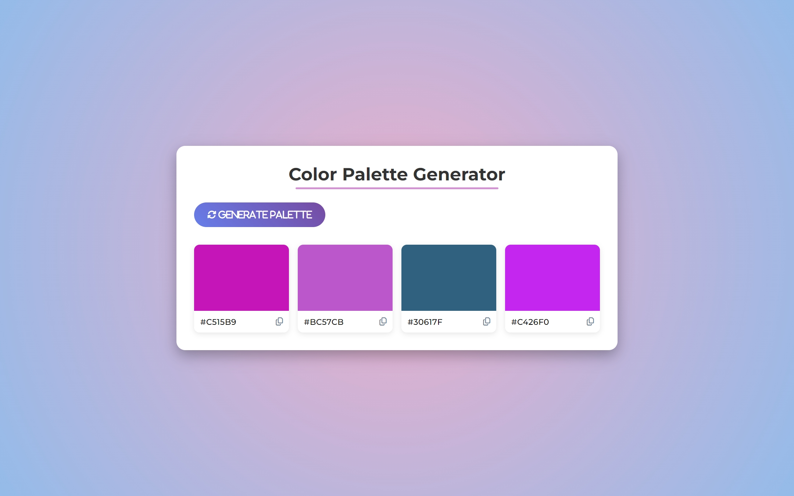
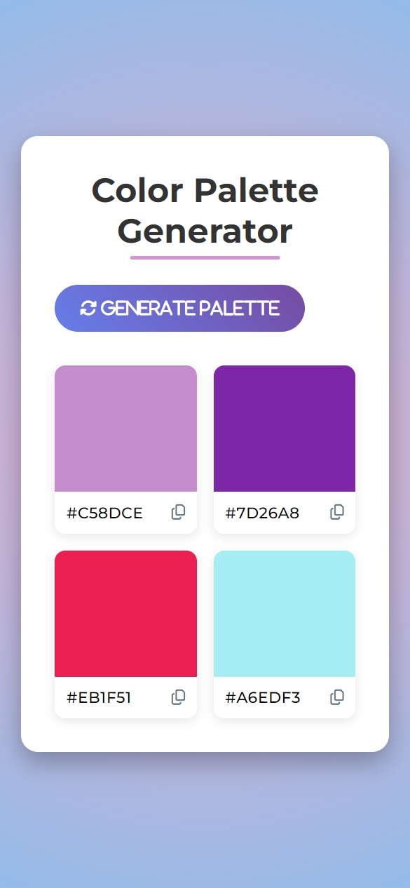

# 🎨 Color Palette Generator

A responsive web app that generates beautiful random color palettes with a single click. Copy any color's hex code with ease.

## ✨ Features

- 🎲 Generate random color palettes
- 📋 Click to copy hex codes
- 📱 Fully responsive design
- 💅 Clean and modern UI

## 🚀 Technologies Used

- HTML5
- CSS3 (with Google Fonts and Font Awesome)
- JavaScript (Vanilla)

## 🖼 Preview

